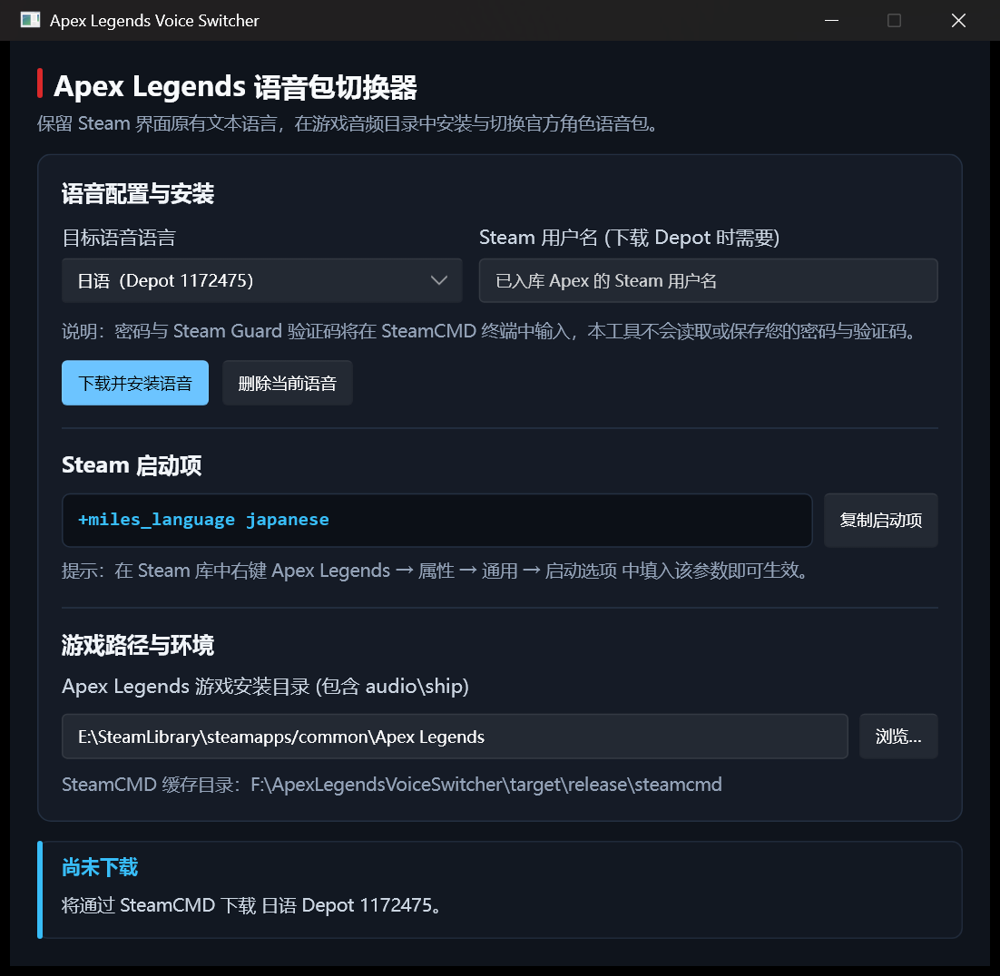

# Apex Legends Voice Switcher

Rust + Slint 编写的 Windows 小工具。保留 Steam 界面/文本语言，只下载并安装另一种 Apex Legends 官方语音，再生成对应 Steam 启动项。

## 界面预览



## 功能

- 自动检测 Steam 与 Apex Legends，也可手动选目录。
- 自动下载 SteamCMD，并用 Steam 账号下载所选语言 Depot。
- 优先创建硬链接；失败后尝试符号链接；最后才移动文件。
- 记录本工具安装的文件，可随时删除。
- 游戏 Build 变化后自动删除不兼容语音。
- 生成 `+miles_language <language>` 启动项。

密码和 Steam Guard 验证码只在 SteamCMD 窗口输入，本工具不会读取或保存。账号需已领取免费的 Apex Legends。

## 支持语音

| 语言 | Depot ID | 启动项语言 |
|---|---:|---|
| 法语 | 1172472 | french |
| 德语 | 1172473 | german |
| 意大利语 | 1172474 | italian |
| 日语 | 1172475 | japanese |
| 韩语 | 1172476 | korean |
| 简体中文 | 1172477 | schinese |
| 波兰语 | 1172478 | polish |
| 俄语 | 1172479 | russian |
| 西班牙语 | 1172480 | spanish |

## 构建

要求 Windows、Rust MSVC 工具链：

```powershell
cargo test
cargo build --release
```

产物：

```text
target\release\ApexLegendsVoiceSwitcher.exe
```

Slint UI 已编译进 EXE，无 WinUI Runtime、XAML 或 PRI 发布文件。开发缓存统一位于 `target/`，可用 `cargo clean` 删除。

## 许可

本项目源代码采用 [MIT License](LICENSE)。

[](https://slint.dev/)

Slint 框架及其他第三方依赖仍适用各自许可。
